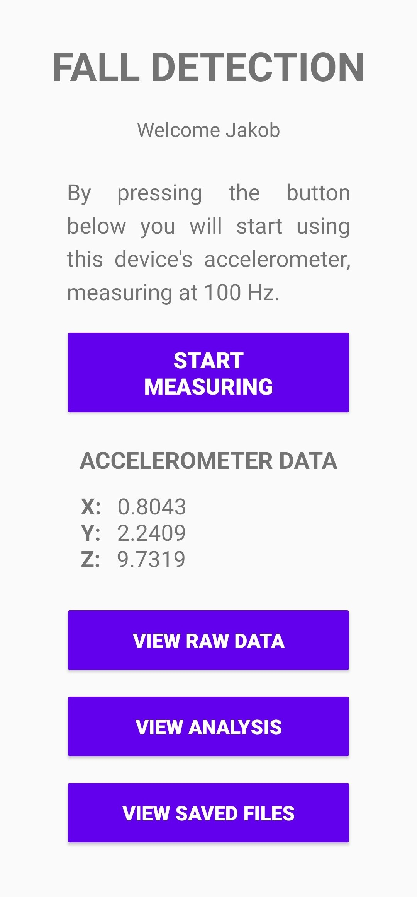
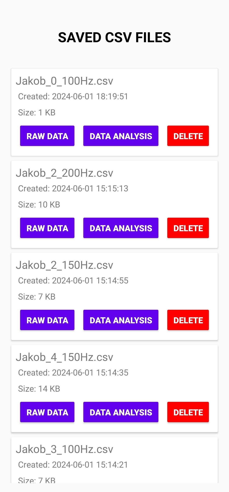

# PHONE FALL DETECTOR

### Android app for detecting vertical fall of the phone using its accelerometer.
#### Developed in Kotlin & XML, using Android Studio IDE.

## FEATURES
- user login (enter experiment name, username & accelerometer frequency in Hz)
- option to start using the device's accelerometer at a specified frequency
- option to stop recording accelerometer data
- ability to automatically save data to .csv file
- view saved .csv files (raw data, visualized data) &rarr; calculation of phone's fall distance using the free fall equation
- delete saved .csv files
 

| LOGIN PAGE                                                                                 | LANDING PAGE                                                                                  |
| :---:                                                                                      | :---:                                                                                         |
|   |  |

| RAW DATA PAGE                                                                              | VISUALIZED DATA PAGE                                                                                      |
| :---:                                                                                      | :---:                                                                                                     |
|  |   |

| FILES PAGE                                                                                                |
| :---:                                                                                                     |
|        |
